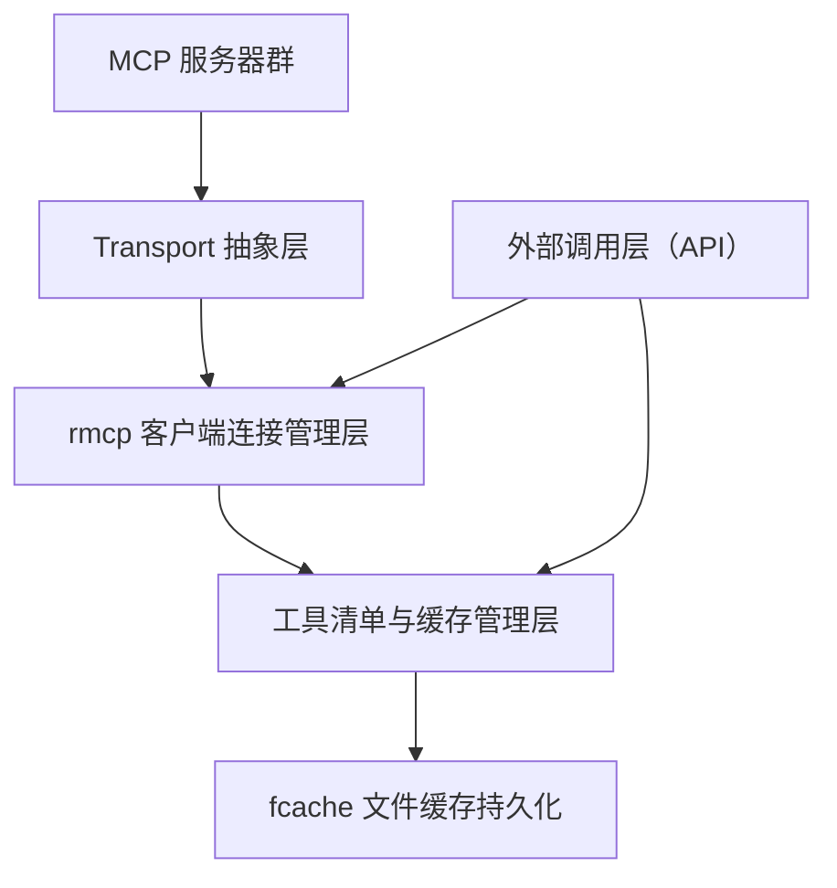
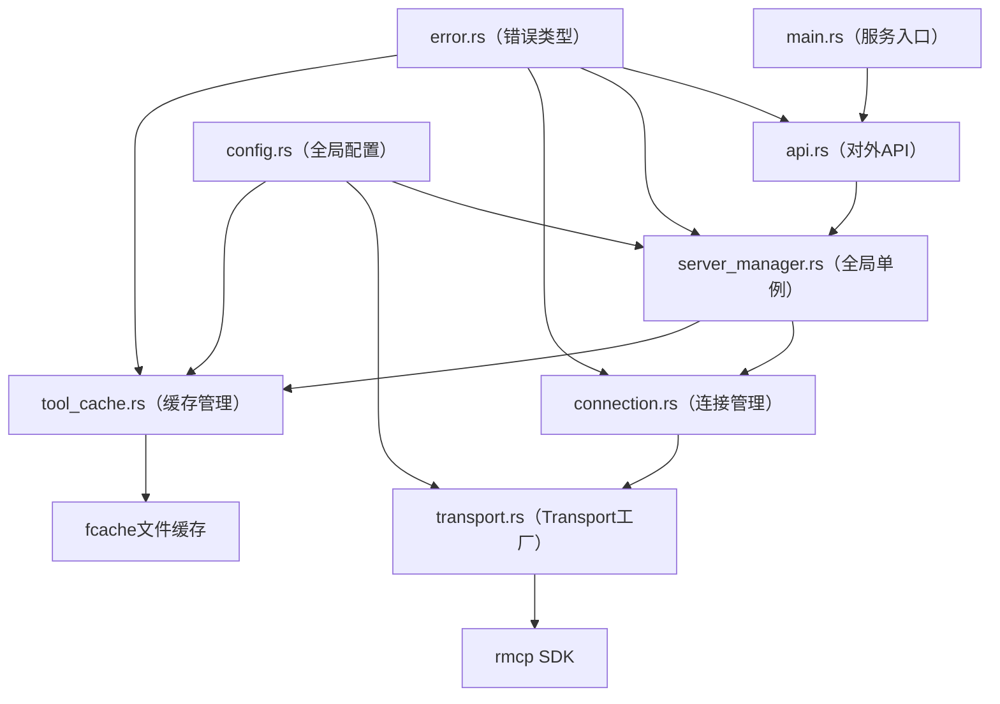

# mcp-v2 开发设计文档

| 文档版本 | 修订日期 | 修订人 | 摘要说明 |
|:---:|:---:|:---:|---|
| v1.0.0 | 2026-05-15 | AI助手 | 初始版本，完成整体架构、核心模块、API接口、缓存策略、并发安全、配置与部署 |

## 1. 概述

**mcp-v2** 是一个基于 Rust 实现的 **MCP（Model Context Protocol）多服务器连接管理与工具调用中间层服务**。服务负责管理一组 MCP 服务器的完整生命周期，对上层业务提供统一的工具发现与远程调用接口，并在本地文件缓存中持久化工具清单以提升启动效率和容灾能力。

> 名词说明：MCP（Model Context Protocol）是面向 AI 模型与外部工具/资源交互的开放协议，定义了 JSON-RPC 通信标准与工具发现机制。

**核心依赖：**

- `rmcp` (v1.7.0) - 官方 Rust SDK，提供客户端连接、Transport 抽象、Peer 句柄与协议通信能力  
- `fcache` (v0.2.0) - 文件缓存库，用于持久化工具清单至本地文件  
- `tokio` - 异步运行时，支撑全异步架构与并发安全  
- `serde` / `serde_json` - 序列化/反序列化工具清单数据结构  
- `tracing` - 结构化日志与链路追踪  
- `arc-swap` - 无锁读取全局热配置，避免读锁竞争

**需求映射总览：**

| 需求编号 | 核心需求 | 文档章节 |
|:---:|---|---|
| 1 | 混合策略管理（启动连接 + 懒加载工具清单） | 2.1、2.2、3.2 |
| 2 | 全量初始化单例，支持从缓存加载 | 2.2、4 |
| 3 | 支持 HTTP 和 STDIO 两种模式 | 2.1、3.1 |
| 4 | 提供外部调用方法（添加/更新/移除/工具列表/工具调用） | 5 |
| 5 | 操作时更新全局状态，保持同步 | 3.2、4.2 |
| 6 | 本地缓存工具清单 | 4 |

## 2. 系统架构

### 2.1 整体分层



- **Transport 层**：负责与各 MCP 服务器建立底层通信连接。兼容 **STDIO**（通过 `TokioChildProcess` 子进程管道）与 **HTTP Streamable**（通过 `StreamableHttpClientTransport` + SSE 双向通信）。
- **连接管理层**：管理 `Peer<RoleClient>` 句柄的生命周期，封装连接建立、握手、重连与优雅关闭。
- **工具清单与缓存管理层**：在初始时提供一个全量单例，**不立即加载工具清单**；仅在首次 `list_tools` 请求时通过 rmcp 的 `list_tools()` 获取完整工具定义，并将其写入 `fcache` 文件缓存。
- **本地文件缓存层**：将工具列表序列化为 JSON 文件写入指定目录，确保服务重启后可快速恢复，无需依赖外部数据库。
- **外部调用层（API）**：暴露统一的公开方法，供上层业务调用。

### 2.2 模块划分

| 模块 | 文件路径 | 职责说明 |
|:---|:---|:---|
| `config` | `src/config.rs` | 定义全局配置数据结构（传输类型、服务器列表、缓存目录、日志级别） |
| `transport` | `src/transport.rs` | 实现统一的 Transport 工厂，封装 `TokioChildProcess` 和 `StreamableHttpClientTransport` |
| `connection` | `src/connection.rs` | 管理与单个 MCP 服务器的 `Peer<RoleClient>` 生命周期，含重连逻辑 |
| `server_manager` | `src/server_manager.rs` | 全局单例，管理所有 MCP 服务器连接，协调添加/移除/更新操作 |
| `tool_cache` | `src/tool_cache.rs` | 工具清单缓存管理，封装 `fcache` 读写操作 |
| `api` | `src/api.rs` | 对外统一 API 接口：`add_mcp`、`remove_mcp`、`update_mcp`、`list_tools`、`call_tool` |
| `error` | `src/error.rs` | 统一错误类型定义 |
| `main` | `src/main.rs` | 服务入口，初始化和启动 |

### 2.3 依赖关系图



## 3. 核心模块设计

### 3.1 Transport 工厂

`Transport` 由 `transport_type` 枚举决定，通过 Feature 开关控制依赖：

- `transport-child-process` (STDIO)：客户端通过 `TokioChildProcess` 与本地或子进程 MCP 服务器通信
- `transport-streamable-http-client-reqwest` (HTTP)：客户端通过 `StreamableHttpClientTransport` 与远程 MCP 服务器通信
- `transport-async-rw`：底层泛型异步读写传输

```toml
# Cargo.toml
rmcp = { version = "1.7.0", features = [
    "client",
    "transport-child-process",
    "transport-streamable-http-client-reqwest",
] }
```

配置示例：

```rust
// src/config.rs
use serde::Deserialize;

#[derive(Debug, Clone, Deserialize)]
#[serde(tag = "type")]
pub enum TransportConfig {
    #[serde(rename = "stdio")]
    Stdio {
        command: String,
        args: Vec<String>,
    },
    #[serde(rename = "http")]
    Http {
        url: String,
    },
}

#[derive(Debug, Clone, Deserialize)]
pub struct McpServerConfig {
    pub id: String,
    pub name: String,
    pub transport: TransportConfig,
}
```

### 3.2 全局 ServerManager（单例模式）

`ServerManager` 是 mcp-v2 的**核心单例**，负责管理**所有 MCP 服务器的连接句柄**以及**工具清单缓存的同步更新**。

**设计要点：**

- **全量初始化但不立即加载工具**：启动时根据配置文件创建所有服务器连接，建立 `Peer<RoleClient>` 句柄；工具清单为空，等待懒加载或主动添加触发
- **懒加载（首次 `list_tools` 触发）**：首次调用 `list_tools` 时，通过 `Peer<RoleClient>` 句柄调用 `list_tools()`，获取结果后**同时写入内存和 `fcache` 文件缓存**
- **添加/移除/更新时同步更新全局状态**：`add` 操作会建立新连接并主动加载工具清单；`remove` 操作会关闭连接并清除缓存；`update` 操作等价于先 `remove` 再 `add`
- **线程安全**：使用 `tokio::sync::RwLock` 保护内部 `HashMap`，确保所有异步操作互不阻塞
- **优雅关闭**：提供 `shutdown()` 方法，遍历所有 `Peer` 句柄调用 `cancel()` 取消连接

```rust
// src/server_manager.rs
use std::collections::HashMap;
use std::sync::Arc;
use tokio::sync::RwLock;
use rmcp::service::{Peer, RoleClient};
use rmcp::model::Tool;
use crate::config::McpServerConfig;
use crate::connection::McpConnection;
use crate::tool_cache::ToolCache;

pub struct ServerManager {
    connections: RwLock<HashMap<String, McpConnection>>,
    tool_cache: RwLock<HashMap<String, Vec<Tool>>>,
    file_cache: Arc<ToolCache>,
    configs: RwLock<HashMap<String, McpServerConfig>>,
}

impl ServerManager {
    /// 全量初始化：为所有配置创建连接，但不加载工具清单
    pub async fn new(configs: Vec<McpServerConfig>, file_cache: Arc<ToolCache>) -> Self { ... }

    /// 添加 MCP 服务器
    pub async fn add_server(&self, config: McpServerConfig) -> Result<()> { ... }

    /// 移除 MCP 服务器
    pub async fn remove_server(&self, id: &str) -> Result<()> { ... }

    /// 更新 MCP 服务器（先移除再添加）
    pub async fn update_server(&self, id: &str, config: McpServerConfig) -> Result<()> { ... }

    /// 获取工具列表（懒加载触发）
    pub async fn list_tools(&self, server_id: Option<&str>) -> Result<Vec<Tool>> { ... }

    /// 调用工具
    pub async fn call_tool(
        &self,
        server_id: &str,
        tool_name: &str,
        arguments: serde_json::Value,
    ) -> Result<serde_json::Value> { ... }

    /// 优雅关闭
    pub async fn shutdown(&self) { ... }
}
```

### 3.3 连接管理

```rust
// src/connection.rs
use rmcp::service::{Peer, RoleClient, serve_client};
use rmcp::transport::IntoTransport;
use rmcp::model::Tool;
use tracing::{info, error};

pub struct McpConnection {
    peer: Peer<RoleClient>,
    // 缓存的工具列表，减少重复请求
    cached_tools: tokio::sync::RwLock<Option<Vec<Tool>>>,
}

impl McpConnection {
    /// 建立连接并完成 MCP 握手
    pub async fn connect(config: &TransportConfig) -> Result<Self> {
        let transport = build_transport(config).await?;
        let client = serve_client(transport.into_transport(), ()).await?;
        info!("MCP connection established");
        Ok(Self {
            peer: client.peer(),
            cached_tools: RwLock::new(None),
        })
    }

    /// 获取工具列表，使用内层缓存避免重复请求
    pub async fn list_tools(&self) -> Result<Vec<Tool>> {
        {
            let cached = self.cached_tools.read().await;
            if let Some(ref tools) = *cached {
                return Ok(tools.clone());
            }
        }
        let tools = self.peer.list_all_tools().await?;
        let mut cached = self.cached_tools.write().await;
        *cached = Some(tools.clone());
        Ok(tools)
    }

    /// 调用工具
    pub async fn call_tool(
        &self,
        tool_name: &str,
        arguments: serde_json::Value,
    ) -> Result<serde_json::Value> {
        let result = self.peer.call_tool(tool_name, arguments).await?;
        Ok(result.content)
    }

    /// 关闭连接
    pub async fn close(&self) {
        self.peer.cancel().await;
        info!("MCP connection closed");
    }
}
```

## 4. 缓存策略

mcp-v2 使用 `fcache` 实现**单层文件缓存**，将工具清单序列化为 JSON 文件存储在磁盘上。

### 4.1 fcache 文件缓存实现

```rust
// src/tool_cache.rs
use fcache::prelude::*;
use rmcp::model::Tool;
use serde::{Deserialize, Serialize};
use std::sync::Arc;
use tracing::{debug, warn};

/// 缓存条目结构
#[derive(Debug, Serialize, Deserialize)]
struct CacheEntry {
    tools: Vec<Tool>,
    #[serde(default)]
    prompts: Vec<Prompt>,   // 支持 prompts 类型
    updated_at: String,
}

pub struct ToolCache {
    cache: Cache,
}

impl ToolCache {
    /// 在指定目录创建缓存实例
    pub fn new(cache_dir: &str) -> Result<Self> {
        let cache = fcache::with_dir(cache_dir)?;
        Ok(Self { cache })
    }

    /// 缓存指定服务器的工具清单
    pub fn cache_tools(&self, server_id: &str, tools: &[Tool]) -> Result<()> {
        let entry = CacheEntry {
            tools: tools.to_vec(),
            prompts: vec![],  // 根据实际需要填充
            updated_at: chrono::Utc::now().to_rfc3339(),
        };
        let json = serde_json::to_string(&entry)?;
        // fcache 通过回调写入文件内容
        let cache_file = self.cache.get(
            &cache_key(server_id),
            |mut file| {
                file.write_all(json.as_bytes())?;
                Ok(())
            },
        )?;
        // 强制刷新确保立即写入磁盘
        cache_file.force_refresh()?;
        debug!("Cached {} tools for server '{}'", tools.len(), server_id);
        Ok(())
    }

    /// 从缓存加载工具清单
    pub fn load_tools(&self, server_id: &str) -> Result<Option<Vec<Tool>>> {
        let cache_file = match self.cache.get_lazy(
            &cache_key(server_id),
            |_file| Ok(()),
        ) {
            Ok(f) => f,
            Err(_) => return Ok(None),
        };
        let mut file = cache_file.open()?;
        let mut content = String::new();
        file.read_to_string(&mut content)?;
        if content.is_empty() {
            return Ok(None);
        }
        let entry: CacheEntry = serde_json::from_str(&content)?;
        debug!("Loaded {} tools from cache for server '{}'", entry.tools.len(), server_id);
        Ok(Some(entry.tools))
    }

    /// 删除指定服务器的缓存
    pub fn invalidate(&self, server_id: &str) -> Result<()> {
        let cache_file = self.cache.get_lazy(
            &cache_key(server_id),
            |_file| Ok(()),
        )?;
        cache_file.invalidate()?;
        debug!("Invalidated cache for server '{}'", server_id);
        Ok(())
    }
}

fn cache_key(server_id: &str) -> String {
    format!("mcp_tools_{}.json", server_id)
}
```

### 4.2 缓存更新策略（同步状态）

| 操作 | 内存更新 | 文件缓存更新 |
|:---|:---|:---|
| **添加 MCP 服务器**（`add_server`） | 建立连接并**立即加载**工具清单，写入内存 HashMap | 立即调用 `cache_tools()` 写入文件 |
| **移除 MCP 服务器**（`remove_server`） | 从 HashMap 中删除 | 调用 `invalidate()` 删除缓存文件 |
| **更新 MCP 服务器**（`update_server`） | 先 `remove` 再 `add`，触发上述两个流程 | 同上 |
| **定期刷新（后台任务）** | 遍历所有连接调用 `list_tools` 更新 | 更新后同步写入文件 |
| **懒加载（首次 `list_tools`）** | 从 MCP 服务器获取并写入 HashMap | 写入文件缓存 |
| **服务启动冷恢复** | 从文件读取填充 HashMap | 直接读取缓存文件 |

## 5. API 接口

所有方法通过 `mcp-v2` 实例暴露，支持内部服务间调用与 HTTP/gRPC 导出。

| 方法 | 参数 | 返回值 | 说明 |
|:---|:---|:---|:---|
| `add_server` | `config: McpServerConfig` | `Result<()>` | 添加并连接一个 MCP 服务器，立即加载工具清单并更新缓存 |
| `remove_server` | `id: &str` | `Result<()>` | 断开连接并从全局状态和缓存中移除 |
| `update_server` | `id: &str, config: McpServerConfig` | `Result<()>` | 等价于 `remove(id)` + `add(config)`，保持状态一致 |
| `list_tools` | `server_id: Option<&str>` | `Result<Vec<Tool>>` | 获取工具列表。指定 `server_id` 则按服务器过滤；不指定则返回所有已连接服务器的工具，附带 `server_id` 来源标识 |
| `call_tool` | `server_id: &str, tool_name: &str, arguments: Value` | `Result<Value>` | 调用指定服务器上的指定工具 |
| `list_prompts` | `server_id: Option<&str>` | `Result<Vec<Prompt>>` | 获取提示列表（扩展接口） |
| `shutdown` | 无 | `Result<()>` | 优雅关闭所有连接并释放资源 |

**接口调用示例：**

```rust
// 创建服务实例
let manager = Arc::new(ServerManager::new(configs, file_cache).await?);

// 1. 添加一个新的 MCP 服务器
let config = McpServerConfig {
    id: "weather-api".into(),
    name: "Weather API".into(),
    transport: TransportConfig::Http { url: "https://mcp.example.com".into() },
};
manager.add_server(config).await?;

// 2. 获取工具列表
let tools = manager.list_tools(Some("weather-api")).await?;

// 3. 调用工具
let result = manager.call_tool(
    "weather-api",
    "get_forecast",
    serde_json::json!({"city": "Beijing", "days": 3}),
).await?;

// 4. 移除服务器
manager.remove_server("weather-api").await?;
```

**⚠️ 同名工具冲突处理**：当不同 MCP 服务器包含同名工具时，`list_tools(None)` 返回的结果中会为每条工具记录附加 `server_id` 字段，调用方通过 `server_id` 明确区分来源服务器；调用 `call_tool` 时必须指定 `server_id`，避免歧义。

## 6. 错误处理

```rust
// src/error.rs
use thiserror::Error;

#[derive(Debug, Error)]
pub enum McpManagerError {
    #[error("MCP server '{server_id}' not found")]
    ServerNotFound { server_id: String },

    #[error("MCP server '{server_id}' already exists")]
    ServerAlreadyExists { server_id: String },

    #[error("MCP connection failed: {message}")]
    ConnectionFailed { message: String },

    #[error("MCP tool call failed: {message}")]
    ToolCallFailed { message: String },

    #[error("Cache operation failed: {source}")]
    CacheError {
        #[from]
        source: fcache::Error,
    },

    #[error("Serialization failed: {source}")]
    SerializationError {
        #[from]
        source: serde_json::Error,
    },

    #[error("MCP protocol error: {source}")]
    McpError {
        #[from]
        source: rmcp::service::ServiceError,
    },

    #[error("Internal error: {message}")]
    Internal { message: String },
}

pub type Result<T> = std::result::Result<T, McpManagerError>;
```

## 7. 并发安全与性能

- **全局状态保护**：使用 `tokio::sync::RwLock` 保护 `ServerManager` 内部的 `HashMap`，写锁仅在添加/移除服务器时短暂持有，读锁在 `list_tools` 时允许多任务并发
- **外部调用线程安全**：所有 API 均设计为 `&self`，可以安全地被多任务并发调用（`Arc<ServerManager>` 共享）
- **配置热重载**：通过 `arc-swap` 实现配置的无锁读取，配置变更时一次性替换，不影响正在进行的连接操作
- **超时控制**：所有 `Peer` 方法均支持超时，避免单点故障阻塞全局
- **后台定期刷新**：可选的 `tokio::spawn` 后台任务（参考 60 秒间隔），定期刷新工具缓存，保持时效性
